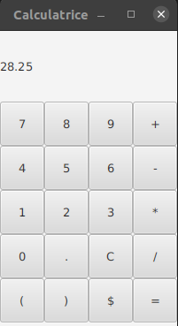

# Calculatrice à mémoire avec interface graphique

This lab proposes the implementation of a general purpose calculator, including a GUI using the [JavaFX library](https://openjfx.io/openjfx-docs/).

